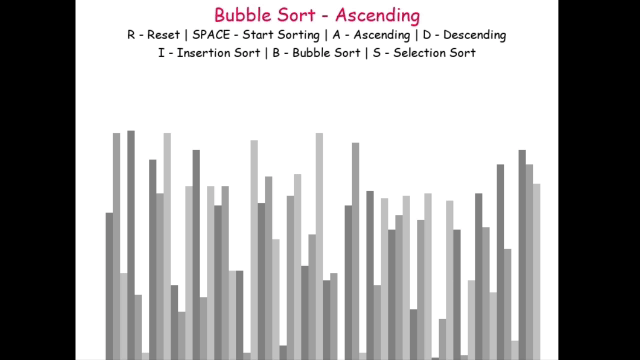

# Sorting Visualizer

The Sorting Visualizer is an interactive application built with Python and Pygame, created to showcase the mechanisms of various sorting algorithms through visual demonstrations. By dynamically illustrating the sorting process, this tool offers an engaging and intuitive way to explore, understand, and compare the behavior and efficiency of different algorithms.

# Demo

